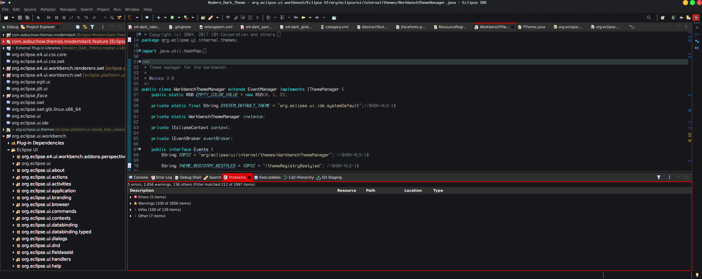
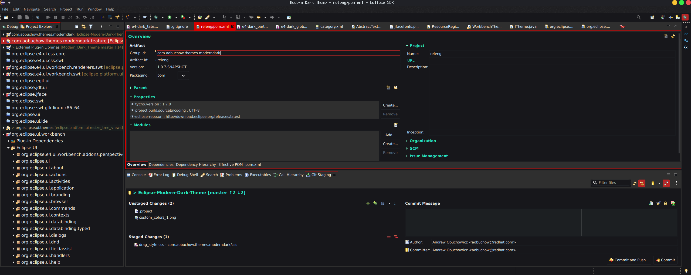

# Eclipse Spectrum Theme 🌌✨

Give Eclipse 4.16+ a *fresh* new look with **Spectrum Theme**. 

This free and open-source theme plugin enhances your Eclipse IDE experience with a
clean visual overhaul that can be customized to your liking.

## Plugin Features:

- **Spectrum Theme ✨:** a clean & flat visual overhaul to Eclipse IDE
- **Customizable theme colors 🌈:** show *your style* by changing the colors 
  used in Spectrum Theme. Associate different color schemes on a 
  per-workspace basis.
- **Customizable Project Explorer font 👀:** change the size & font of the Project Explorer in Eclipse IDE

## 📸 Screenshots

**Note:** The above screenshots were taken on Linux using with [Abrus-dark](https://github.com/vinceliuice/Abrus-gtk-theme) GTK theme.

### 🎨 Color customization examples

#### How to customize Spectrum Theme's color & font preferences

Open Eclipse's preferences and navigate to General >> Appearance >> Colors and Fonts. The plugin's color & font preferences are under the Spectrum category folder.

## 📥 Installation

Available via Eclipse Marketplace or update site. 

### Marketplace link
Drag the icon below to your running Eclipse workspace

### Update Site

`https://raw.githubusercontent.com/AObuchow/Eclipse-Spectrum-Theme/updatesite/updatesite/`

## Planned features:

- 💾 Saving user color schemes to CSS, which can be easily shared 

- 🔮 Dynamically generated color schemes (from user-selected colors or randomly)
